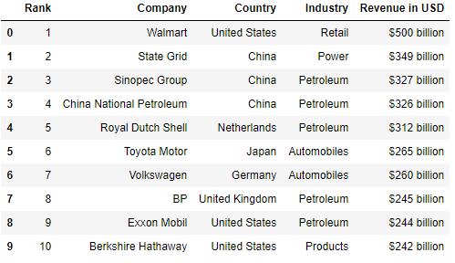
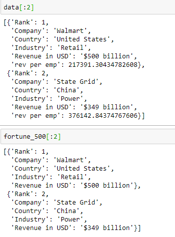
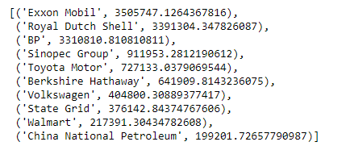
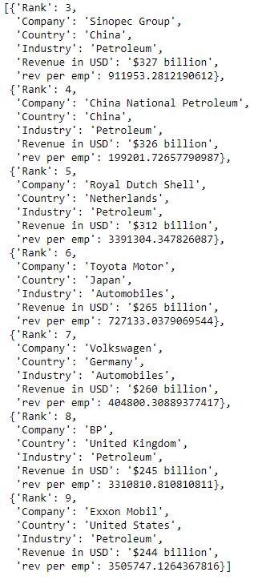

# Data Munging (?)

Günlük hayatta veriler istediğimiz kadar basit olmaz, bunlar üzerinde işlemler yaparak uygun hale getiririz

## Verilerin Sağlaması Gereken Özellikler

- Tek tablodan oluşan basit veya bağlantılı bir kaç tablodan oluşan
  - Farklı veriler için *mapping* ile veri tipleri birbirine benzetilir
- Kolay analiz edilebilir formatta olan
- Makine öğrenimine sokulabilecek veriler
- Düşük karmaşıklığa sahip
- Yüksek boyutlu veriler için optimizasyon

## Veri Çekme İşlemleri

Web siteleri üzerindeki tabloları çekmek için `pd.read_html` kullan.

<details>
<summary>Wikipedia'dan tablo çekme</summary>

Tüm tablo verileri arasında `0`, `1` ... değerleri ile gezinebiliriz.

```py
import pandas as pd
import json
df = pd.read_html('https://en.wikipedia.org/w/index.php?title=Fortune_Global_500&oldid=855890446', header=0)[1]
fortune_500 = json.loads(df.to_json(orient="records"))
df
```



```py
df_list = pd.read_html("https://en.wikipedia.org/w/index.php?title=Automotive_industry&oldid=875776152", header=0)
car_totals = json.loads(df_list[1].to_json(orient="records"))
car_by_man = json.loads(df_list[3].to_json(orient='records'))
```


</details>

<details>
<summary>Harici verileri tablomuza aktarma</summary>

Harici verilerimizde Inc, AG gibi şirket kısaltmaları mevcut, bunları kaldırmak için *mapping* işlemine başvururuz

```py
other_data = [
    {"name": "Walmart",
     "employees": 2300000,
     "year founded": 1962
    },
    {"name": "State Grid Corporation of China",
     "employees": 927839,
     "year founded": 2002},
    {"name": "China Petrochemical Corporation",
     "employees":358571,
     "year founded": 1998
     },
    {"name": "China National Petroleum Corporation",
     "employees": 1636532,
     "year founded": 1988},
    {"name": "Toyota Motor Corporation",
     "employees": 364445,
     "year founded": 1937},
    {"name": "Volkswagen AG",
     "employees": 642292,
     "year founded": 1937},
    {"name": "Royal Dutch Shell",
     "employees": 92000,
     "year founded": 1907},
    {"name": "Berkshire Hathaway Inc.",
     "employees":377000,
     "year founded": 1839},
    {"name": "Apple Inc.",
     "employees": 123000,
     "year founded": 1976},
    {"name": "Exxon Mobile Corporation",
     "employees": 69600,
     "year founded": 1999},
    {"name": "BP plc",
     "employees": 74000,
     "year founded": 1908}
]

mapping = {
    'Apple': 'Apple Inc.',
    'BP': 'BP plc',
    'Berkshire Hathaway': 'Berkshire Hathaway Inc.',
    'China National Petroleum': 'China National Petroleum Corporation',
    'Exxon Mobil': 'Exxon Mobile Corporation',
    'Sinopec Group': 'China Petrochemical Corporation',
    'State Grid': 'State Grid Corporation of China',
    'Toyota Motor': 'Toyota Motor Corporation',
    'Volkswagen': 'Volkswagen AG'
}
```

</details>

<details>
<summary>Veri yapısını değiştirme örneği</summary>

`500$ billion` şeklindeki verileri bilimsem `500e9` (500 x 10^9) verisine çevirme

```py
def convert_revenue(x):
    return float(x.lstrip('$').rstrip('billion')) * 1e9

assert convert_revenue('$500 billion') == 500e9 # Test işlemi
```

</details>

<details>
<summary>Yeni işlenmiş veri ortaya çıkarma</summary>

İşlenmiş verileri her daim ana veriyi bozmadan, ek objelerde tutmalıyız.

```py
def rev_per_emp(company):
    name = company[u'Company']
    n_employees = dict_data[mapping.get(name, name)].get('employees')
    company['rev per emp'] = convert_revenue(company[u'Revenue in USD'])/n_employees
    return company

def compute_copy(d, func):
    return func({k:v for k,v in d.items()})

data = list(map(lambda x : compute_copy(x, rev_per_emp), fortune_500))
```



</details>

<details>
<summary>Verileri sıralama işlemleri</summary>

Sıralama işlemleri karar verme işlemleri için çok önemlidir.

```py
rev_per_emp = sorted(
    [i[u'Company'], i['rev per emp'] for i in data], 
    key=lambda x : x[1],
    reverse=True
)
rev_per_emp
```



</details>

<details>
<summary>Verileri saydırma işlemleri</summary>

```py
from collection import Counter
Counter(i[u'Industry'] for i in data)
```


</details>


<details>
<summary>Verileri kategorilere ayırma</summary>

Belli değerlere özgü analiz yapmak için etkili bir çözümdür.

```py
sub_data = [i for i in data if i[u'Industry'] in [u'Automobiles', u'Petroleum']]
sub_data
```



</details>

